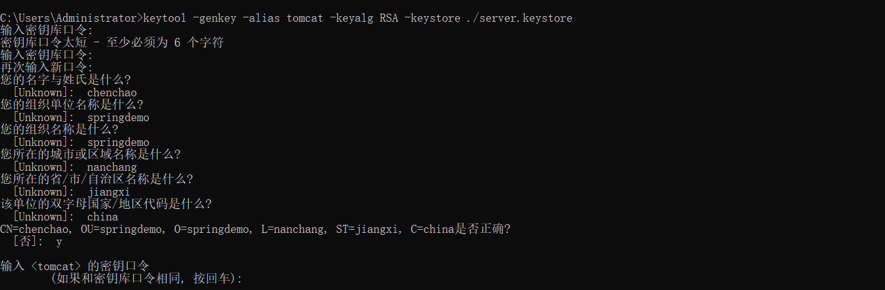

# spring-boot-demo-https

> 此 demo 主要演示了 Spring Boot 如何集成 https

## 1. 生成证书

首先使用 jdk 自带的 keytool 命令生成证书复制到项目的 `resources` 目录下（生成的证书一般在用户目录下 C:\Users\Administrator\server.keystore）

> 自己生成的证书浏览器会有危险提示,去ssl网站上使用金钱申请则不会



## 2. 添加配置

1. 在配置文件配置生成的证书

```yaml
server:
  ssl:
    # 证书路径
    key-store: classpath:server.keystore
    key-alias: tomcat
    enabled: true
    key-store-type: JKS
    #与申请时输入一致
    key-store-password: 123456
    # 浏览器默认端口 和 80 类似
  port: 443
```

2. 配置 Tomcat

```java
/**
 * <p>
 * HTTPS 配置类
 * </p>
 *
 * @author yangkai.shen
 * @date Created in 2020/1/19 10:31
 */
@Configuration
public class HttpsConfig {
    /**
     * 配置 http(80) -> 强制跳转到 https(443)
     */
    @Bean
    public Connector connector() {
        Connector connector = new Connector("org.apache.coyote.http11.Http11NioProtocol");
        connector.setScheme("http");
        connector.setPort(80);
        connector.setSecure(false);
        connector.setRedirectPort(443);
        return connector;
    }

    @Bean
    public TomcatServletWebServerFactory tomcatServletWebServerFactory(Connector connector) {
        TomcatServletWebServerFactory tomcat = new TomcatServletWebServerFactory() {
            @Override
            protected void postProcessContext(Context context) {
                SecurityConstraint securityConstraint = new SecurityConstraint();
                securityConstraint.setUserConstraint("CONFIDENTIAL");
                SecurityCollection collection = new SecurityCollection();
                collection.addPattern("/*");
                securityConstraint.addCollection(collection);
                context.addConstraint(securityConstraint);
            }
        };
        tomcat.addAdditionalTomcatConnectors(connector);
        return tomcat;
    }
}
```

## 3. 测试

启动项目，浏览器访问 http://localhost 将自动跳转到 https://localhost

## 4. 参考

- `keytool`命令参考

```bash
$ keytool --help
密钥和证书管理工具

命令:

 -certreq            生成证书请求
 -changealias        更改条目的别名
 -delete             删除条目
 -exportcert         导出证书
 -genkeypair         生成密钥对
 -genseckey          生成密钥
 -gencert            根据证书请求生成证书
 -importcert         导入证书或证书链
 -importpass         导入口令
 -importkeystore     从其他密钥库导入一个或所有条目
 -keypasswd          更改条目的密钥口令
 -list               列出密钥库中的条目
 -printcert          打印证书内容
 -printcertreq       打印证书请求的内容
 -printcrl           打印 CRL 文件的内容
 -storepasswd        更改密钥库的存储口令

使用 "keytool -command_name -help" 获取 command_name 的用法
```

- [Java Keytool工具简介](https://blog.csdn.net/liumiaocn/article/details/61921014)