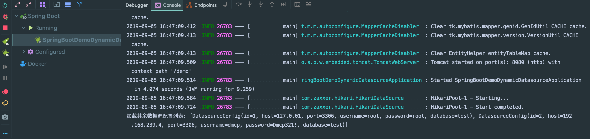
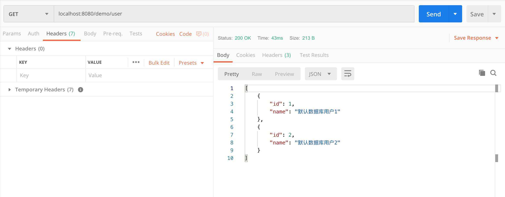
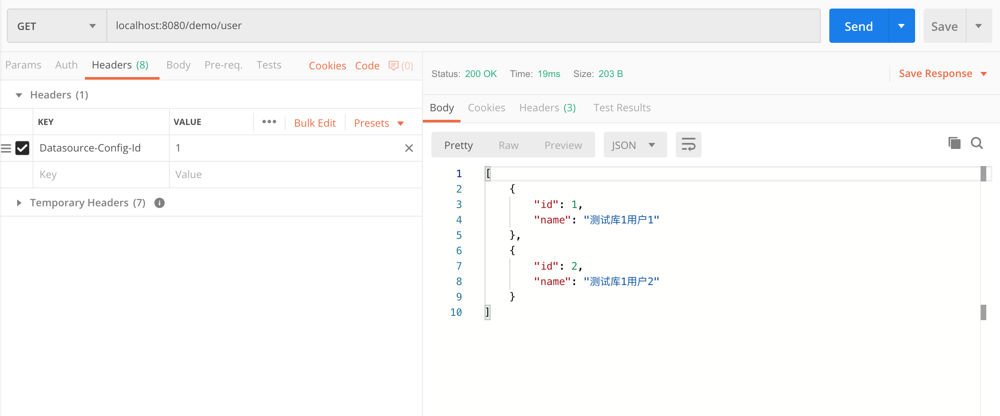
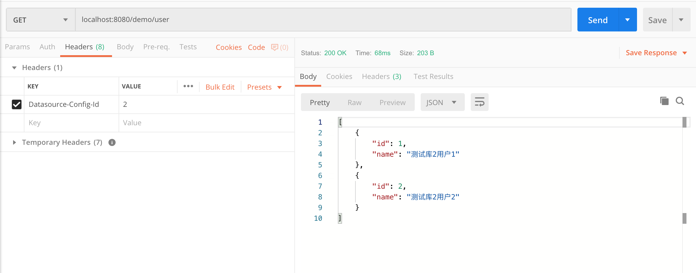

# spring-boot-demo-dynamic-datasource

> 此 demo 主要演示了 Spring Boot 项目如何通过接口`动态添加/删除`数据源，添加数据源之后如何`动态切换`数据源，然后使用 mybatis 查询切换后的数据源的数据。

## 1. 环境准备

1. 执行 db 目录下的SQL脚本
2. 在默认数据源下执行 `init.sql`
3. 在所有数据源分别执行 `user.sql`

## 2. 主要代码

### 2.1.pom.xml

```xml
<?xml version="1.0" encoding="UTF-8"?>
<project xmlns="http://maven.apache.org/POM/4.0.0" xmlns:xsi="http://www.w3.org/2001/XMLSchema-instance"
         xsi:schemaLocation="http://maven.apache.org/POM/4.0.0 https://maven.apache.org/xsd/maven-4.0.0.xsd">
  <modelVersion>4.0.0</modelVersion>

  <artifactId>spring-boot-demo-dynamic-datasource</artifactId>
  <version>1.0.0-SNAPSHOT</version>
  <packaging>jar</packaging>

  <name>spring-boot-demo-dynamic-datasource</name>
  <description>Demo project for Spring Boot</description>

  <parent>
    <groupId>com.xkcoding</groupId>
    <artifactId>spring-boot-demo</artifactId>
    <version>1.0.0-SNAPSHOT</version>
  </parent>

  <properties>
    <project.build.sourceEncoding>UTF-8</project.build.sourceEncoding>
    <project.reporting.outputEncoding>UTF-8</project.reporting.outputEncoding>
    <java.version>1.8</java.version>
  </properties>

  <dependencies>
    <dependency>
      <groupId>org.springframework.boot</groupId>
      <artifactId>spring-boot-starter-web</artifactId>
    </dependency>

    <dependency>
      <groupId>org.springframework.boot</groupId>
      <artifactId>spring-boot-starter-aop</artifactId>
    </dependency>

    <dependency>
      <groupId>tk.mybatis</groupId>
      <artifactId>mapper-spring-boot-starter</artifactId>
      <version>2.1.5</version>
    </dependency>

    <dependency>
      <groupId>mysql</groupId>
      <artifactId>mysql-connector-java</artifactId>
      <scope>runtime</scope>
    </dependency>

    <dependency>
      <groupId>org.projectlombok</groupId>
      <artifactId>lombok</artifactId>
      <optional>true</optional>
    </dependency>

    <dependency>
      <groupId>org.springframework.boot</groupId>
      <artifactId>spring-boot-starter-test</artifactId>
      <scope>test</scope>
    </dependency>
  </dependencies>

  <build>
    <finalName>spring-boot-demo-dynamic-datasource</finalName>
    <plugins>
      <plugin>
        <groupId>org.springframework.boot</groupId>
        <artifactId>spring-boot-maven-plugin</artifactId>
      </plugin>
    </plugins>
  </build>

</project>
```

### 2.2. 基础配置类

- DatasourceConfiguration.java

> 这个类主要是通过 `DataSourceBuilder` 去构建一个我们自定义的数据源，将其放入 Spring 容器里

```java
/**
 * <p>
 * 数据源配置
 * </p>
 *
 * @author yangkai.shen
 * @date Created in 2019/9/4 10:27
 */
@Configuration
public class DatasourceConfiguration {

    @Bean
    @ConfigurationProperties(prefix = "spring.datasource")
    public DataSource dataSource() {
        DataSourceBuilder<?> dataSourceBuilder = DataSourceBuilder.create();
        dataSourceBuilder.type(DynamicDataSource.class);
        return dataSourceBuilder.build();
    }
}
```

- MybatisConfiguration.java

> 这个类主要是将我们上一步构建出来的数据源配置到 Mybatis 的 `SqlSessionFactory` 里

```java
/**
 * <p>
 * mybatis配置
 * </p>
 *
 * @author yangkai.shen
 * @date Created in 2019/9/4 16:20
 */
@Configuration
@MapperScan(basePackages = "com.xkcoding.dynamicdatasource.mapper", sqlSessionFactoryRef = "sqlSessionFactory")
public class MybatisConfiguration {
    /**
     * 创建会话工厂。
     *
     * @param dataSource 数据源
     * @return 会话工厂
     */
    @Bean(name = "sqlSessionFactory")
    @SneakyThrows
    public SqlSessionFactory getSqlSessionFactory(@Qualifier("dataSource") DataSource dataSource) {
        SqlSessionFactoryBean bean = new SqlSessionFactoryBean();
        bean.setDataSource(dataSource);
        return bean.getObject();
    }
}
```

### 2.3. 动态数据源主要逻辑

- DatasourceConfigContextHolder.java

> 该类主要用于绑定当前线程所使用的数据源 id，通过 ThreadLocal 保证同一线程内不可被修改

```java
/**
 * <p>
 * 数据源标识管理
 * </p>
 *
 * @author yangkai.shen
 * @date Created in 2019/9/4 14:16
 */
public class DatasourceConfigContextHolder {
    private static final ThreadLocal<Long> DATASOURCE_HOLDER = ThreadLocal.withInitial(() -> DatasourceHolder.DEFAULT_ID);

    /**
     * 设置默认数据源
     */
    public static void setDefaultDatasource() {
        DATASOURCE_HOLDER.remove();
        setCurrentDatasourceConfig(DatasourceHolder.DEFAULT_ID);
    }

    /**
     * 获取当前数据源配置id
     *
     * @return 数据源配置id
     */
    public static Long getCurrentDatasourceConfig() {
        return DATASOURCE_HOLDER.get();
    }

    /**
     * 设置当前数据源配置id
     *
     * @param id 数据源配置id
     */
    public static void setCurrentDatasourceConfig(Long id) {
        DATASOURCE_HOLDER.set(id);
    }

}
```

- DynamicDataSource.java

> 该类继承 `com.zaxxer.hikari.HikariDataSource`，主要用于动态切换数据源连接。

```java
/**
 * <p>
 * 动态数据源
 * </p>
 *
 * @author yangkai.shen
 * @date Created in 2019/9/4 10:41
 */
@Slf4j
public class DynamicDataSource extends HikariDataSource {
    @Override
    public Connection getConnection() throws SQLException {
        // 获取当前数据源 id
        Long id = DatasourceConfigContextHolder.getCurrentDatasourceConfig();
        // 根据当前id获取数据源
        HikariDataSource datasource = DatasourceHolder.INSTANCE.getDatasource(id);

        if (null == datasource) {
            datasource = initDatasource(id);
        }

        return datasource.getConnection();
    }

    /**
     * 初始化数据源
     * @param id 数据源id
     * @return 数据源
     */
    private HikariDataSource initDatasource(Long id) {
        HikariDataSource dataSource = new HikariDataSource();

        // 判断是否是默认数据源
        if (DatasourceHolder.DEFAULT_ID.equals(id)) {
            // 默认数据源根据 application.yml 配置的生成
            DataSourceProperties properties = SpringUtil.getBean(DataSourceProperties.class);
            dataSource.setJdbcUrl(properties.getUrl());
            dataSource.setUsername(properties.getUsername());
            dataSource.setPassword(properties.getPassword());
            dataSource.setDriverClassName("com.mysql.cj.jdbc.Driver");
        } else {
            // 不是默认数据源，通过缓存获取对应id的数据源的配置
            DatasourceConfig datasourceConfig = DatasourceConfigCache.INSTANCE.getConfig(id);

            if (datasourceConfig == null) {
                throw new RuntimeException("无此数据源");
            }

            dataSource.setJdbcUrl(datasourceConfig.buildJdbcUrl());
            dataSource.setUsername(datasourceConfig.getUsername());
            dataSource.setPassword(datasourceConfig.getPassword());
            dataSource.setDriverClassName("com.mysql.cj.jdbc.Driver");
        }
        // 将创建的数据源添加到数据源管理器中，绑定当前线程
        DatasourceHolder.INSTANCE.addDatasource(id, dataSource);
        return dataSource;
    }
}
```

- DatasourceScheduler.java

> 该类主要用于调度任务

```java
/**
 * <p>
 * 数据源缓存释放调度器
 * </p>
 *
 * @author yangkai.shen
 * @date Created in 2019/9/4 14:42
 */
public enum DatasourceScheduler {
    /**
     * 当前实例
     */
    INSTANCE;

    private AtomicInteger cacheTaskNumber = new AtomicInteger(1);
    private ScheduledExecutorService scheduler;

    DatasourceScheduler() {
        create();
    }

    private void create() {
        this.shutdown();
        this.scheduler = new ScheduledThreadPoolExecutor(10, r -> new Thread(r, String.format("Datasource-Release-Task-%s", cacheTaskNumber.getAndIncrement())));
    }

    private void shutdown() {
        if (null != this.scheduler) {
            this.scheduler.shutdown();
        }
    }

    public void schedule(Runnable task,long delay){
        this.scheduler.scheduleAtFixedRate(task, delay, delay, TimeUnit.MILLISECONDS);
    }

}
```

- DatasourceManager.java

> 该类主要用于管理数据源，记录数据源最后使用时间，同时判断是否长时间未使用，超过一定时间未使用，会被释放连接

```java
/**
 * <p>
 * 数据源管理类
 * </p>
 *
 * @author yangkai.shen
 * @date Created in 2019/9/4 14:27
 */
public class DatasourceManager {
    /**
     * 默认释放时间
     */
    private static final Long DEFAULT_RELEASE = 10L;

    /**
     * 数据源
     */
    @Getter
    private HikariDataSource dataSource;

    /**
     * 上一次使用时间
     */
    private LocalDateTime lastUseTime;

    public DatasourceManager(HikariDataSource dataSource) {
        this.dataSource = dataSource;
        this.lastUseTime = LocalDateTime.now();
    }

    /**
     * 是否已过期，如果过期则关闭数据源
     *
     * @return 是否过期，{@code true} 过期，{@code false} 未过期
     */
    public boolean isExpired() {
        if (LocalDateTime.now().isBefore(this.lastUseTime.plusMinutes(DEFAULT_RELEASE))) {
            return false;
        }
        this.dataSource.close();
        return true;
    }

    /**
     * 刷新上次使用时间
     */
    public void refreshTime() {
        this.lastUseTime = LocalDateTime.now();
    }
}
```

- DatasourceHolder.java

> 该类主要用于管理数据源，同时通过 `DatasourceScheduler` 定时检查数据源是否长时间未使用，超时则释放连接

```java
/**
 * <p>
 * 数据源管理
 * </p>
 *
 * @author yangkai.shen
 * @date Created in 2019/9/4 14:23
 */
public enum DatasourceHolder {
    /**
     * 当前实例
     */
    INSTANCE;

    /**
     * 启动执行，定时5分钟清理一次
     */
    DatasourceHolder() {
        DatasourceScheduler.INSTANCE.schedule(this::clearExpiredDatasource, 5 * 60 * 1000);
    }

    /**
     * 默认数据源的id
     */
    public static final Long DEFAULT_ID = -1L;

    /**
     * 管理动态数据源列表。
     */
    private static final Map<Long, DatasourceManager> DATASOURCE_CACHE = new ConcurrentHashMap<>();

    /**
     * 添加动态数据源
     *
     * @param id         数据源id
     * @param dataSource 数据源
     */
    public synchronized void addDatasource(Long id, HikariDataSource dataSource) {
        DatasourceManager datasourceManager = new DatasourceManager(dataSource);
        DATASOURCE_CACHE.put(id, datasourceManager);
    }

    /**
     * 查询动态数据源
     *
     * @param id 数据源id
     * @return 数据源
     */
    public synchronized HikariDataSource getDatasource(Long id) {
        if (DATASOURCE_CACHE.containsKey(id)) {
            DatasourceManager datasourceManager = DATASOURCE_CACHE.get(id);
            datasourceManager.refreshTime();
            return datasourceManager.getDataSource();
        }
        return null;
    }

    /**
     * 清除超时的数据源
     */
    public synchronized void clearExpiredDatasource() {
        DATASOURCE_CACHE.forEach((k, v) -> {
            // 排除默认数据源
            if (!DEFAULT_ID.equals(k)) {
                if (v.isExpired()) {
                    DATASOURCE_CACHE.remove(k);
                }
            }
        });
    }

    /**
     * 清除动态数据源
     * @param id 数据源id
     */
    public synchronized void removeDatasource(Long id) {
        if (DATASOURCE_CACHE.containsKey(id)) {
            // 关闭数据源
            DATASOURCE_CACHE.get(id).getDataSource().close();
            // 移除缓存
            DATASOURCE_CACHE.remove(id);
        }
    }
}
```

- DatasourceConfigCache.java

> 该类主要用于缓存数据源的配置，用户生成数据源时，获取数据源连接参数

```java
/**
 * <p>
 * 数据源配置缓存
 * </p>
 *
 * @author yangkai.shen
 * @date Created in 2019/9/4 17:13
 */
public enum DatasourceConfigCache {
    /**
     * 当前实例
     */
    INSTANCE;

    /**
     * 管理动态数据源列表。
     */
    private static final Map<Long, DatasourceConfig> CONFIG_CACHE = new ConcurrentHashMap<>();

    /**
     * 添加数据源配置
     *
     * @param id     数据源配置id
     * @param config 数据源配置
     */
    public synchronized void addConfig(Long id, DatasourceConfig config) {
        CONFIG_CACHE.put(id, config);
    }

    /**
     * 查询数据源配置
     *
     * @param id 数据源配置id
     * @return 数据源配置
     */
    public synchronized DatasourceConfig getConfig(Long id) {
        if (CONFIG_CACHE.containsKey(id)) {
            return CONFIG_CACHE.get(id);
        }
        return null;
    }

    /**
     * 清除数据源配置
     */
    public synchronized void removeConfig(Long id) {
        CONFIG_CACHE.remove(id);
        // 同步清除 DatasourceHolder 对应的数据源
        DatasourceHolder.INSTANCE.removeDatasource(id);
    }
}
```

### 2.4. 启动类

> 启动后，使用默认数据源查询数据源配置列表，将其缓存到 `DatasourceConfigCache` 里，以供后续使用

```java
/**
 * <p>
 * 启动器
 * </p>
 *
 * @author yangkai.shen
 * @date Created in 2019/9/4 17:57
 */
@SpringBootApplication
@RequiredArgsConstructor(onConstructor_ = @Autowired)
public class SpringBootDemoDynamicDatasourceApplication implements CommandLineRunner {
    private final DatasourceConfigMapper configMapper;

    public static void main(String[] args) {
        SpringApplication.run(SpringBootDemoDynamicDatasourceApplication.class, args);
    }

    @Override
    public void run(String... args) {
        // 设置默认的数据源
        DatasourceConfigContextHolder.setDefaultDatasource();
        // 查询所有数据库配置列表
        List<DatasourceConfig> datasourceConfigs = configMapper.selectAll();
        System.out.println("加载其余数据源配置列表: " + datasourceConfigs);
        // 将数据库配置加入缓存
        datasourceConfigs.forEach(config -> DatasourceConfigCache.INSTANCE.addConfig(config.getId(), config));
    }
}
```

### 2.5. 其余代码参考 demo

## 3. 测试

启动项目，可以看到控制台读取到数据库已配置的数据源信息



通过 PostMan 等工具测试

- 默认数据源查询



- 根据数据源id为1的数据源查询



- 根据数据源id为2的数据源查询



- 可以通过测试数据源的`增加/删除`，再去查询对应数据源的数据

> 删除数据源：
>
> - DELETE http://localhost:8080/config/{id}
>
> 新增数据源: 
>
> - POST http://localhost:8080/config
>
> - 参数：
>
> ```json
> {
>     "host": "数据库IP",
>     "port": 3306,
>     "username": "用户名",
>     "password": "密码",
>     "database": "数据库"
> }
> ```

## 4. 优化

如上测试，我们只需要通过在 header 里传递数据源的参数，即可做到动态切换数据源，怎么做到的呢？

答案就是 `AOP`

```java
/**
 * <p>
 * 数据源选择器切面
 * </p>
 *
 * @author yangkai.shen
 * @date Created in 2019/9/4 16:52
 */
@Aspect
@Component
@RequiredArgsConstructor(onConstructor_ = @Autowired)
public class DatasourceSelectorAspect {
    @Pointcut("execution(public * com.xkcoding.dynamic.datasource.controller.*.*(..))")
    public void datasourcePointcut() {
    }

    /**
     * 前置操作，拦截具体请求，获取header里的数据源id，设置线程变量里，用于后续切换数据源
     */
    @Before("datasourcePointcut()")
    public void doBefore(JoinPoint joinPoint) {
        Signature signature = joinPoint.getSignature();
        MethodSignature methodSignature = (MethodSignature) signature;
        Method method = methodSignature.getMethod();

        // 排除不可切换数据源的方法
        DefaultDatasource annotation = method.getAnnotation(DefaultDatasource.class);
        if (null != annotation) {
            DatasourceConfigContextHolder.setDefaultDatasource();
        } else {
            RequestAttributes requestAttributes = RequestContextHolder.getRequestAttributes();
            ServletRequestAttributes attributes = (ServletRequestAttributes) requestAttributes;
            HttpServletRequest request = attributes.getRequest();
            String configIdInHeader = request.getHeader("Datasource-Config-Id");
            if (StringUtils.hasText(configIdInHeader)) {
                long configId = Long.parseLong(configIdInHeader);
                DatasourceConfigContextHolder.setCurrentDatasourceConfig(configId);
            } else {
                DatasourceConfigContextHolder.setDefaultDatasource();
            }
        }
    }

    /**
     * 后置操作，设置回默认的数据源id
     */
    @AfterReturning("datasourcePointcut()")
    public void doAfter() {
        DatasourceConfigContextHolder.setDefaultDatasource();
    }

}
```

此时需要考虑，我们是否每个方法都允许用户去切换数据源呢？答案肯定是不行的，所以我们定义了一个注解去标识，当前方法仅可以使用默认数据源。

```java
/**
 * <p>
 * 用户标识仅可以使用默认数据源
 * </p>
 *
 * @author yangkai.shen
 * @date Created in 2019/9/4 17:37
 */
@Target({ElementType.METHOD})
@Retention(RetentionPolicy.RUNTIME)
@Documented
public @interface DefaultDatasource {
}
```

完结，撒花✿✿ヽ(°▽°)ノ✿