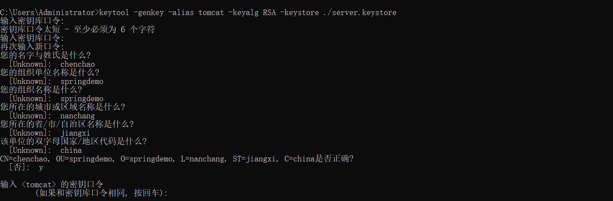

# Getting Started

### Reference Documentation
For further reference, please consider the following sections:

* [Official Apache Maven documentation](https://maven.apache.org/guides/index.html)
* [Spring Boot Maven Plugin Reference Guide](https://docs.spring.io/spring-boot/docs/2.2.2.RELEASE/maven-plugin/)


1. 首先使用jdk 自带的keytool 命令生成证书(一般在用户目录下C:\Users\Administrator\server.keystore) 复制到项目中
> 自己生成的证书浏览器会有危险提示,去ssl网站上使用金钱申请则不会




2. 然后添加配置
```yml
server:
  ssl:
    # 证书路径
    key-store: spring-boot-demo-https\src\main\resources\server.keystore
    key-alias: tomcat
    enabled: true
    key-store-type: JKS
    #与申请时输入一致
    key-store-password: 123456
    # 浏览器默认端口 和 80 类似
  port: 443
#debug: true


```

3. 需要与http 自动跳转再添加bean

```java

    @Bean
    public Connector connector(){
        Connector connector=new Connector("org.apache.coyote.http11.Http11NioProtocol");
        connector.setScheme("http");
        connector.setPort(80);
        connector.setSecure(false);
        connector.setRedirectPort(443);
        return connector;
    }

    @Bean
    public TomcatServletWebServerFactory tomcatServletWebServerFactory(Connector connector){
        TomcatServletWebServerFactory tomcat=new TomcatServletWebServerFactory(){
            @Override
            protected void postProcessContext(Context context) {
                SecurityConstraint securityConstraint=new SecurityConstraint();
                securityConstraint.setUserConstraint("CONFIDENTIAL");
                SecurityCollection collection=new SecurityCollection();
                collection.addPattern("/*");
                securityConstraint.addCollection(collection);
                context.addConstraint(securityConstraint);
            }
        };
        tomcat.addAdditionalTomcatConnectors(connector);
        return tomcat;
    }

```


