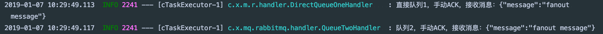
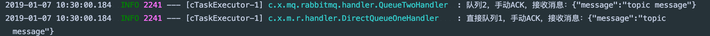
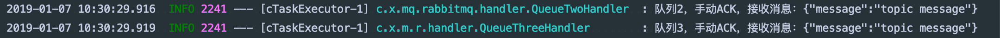
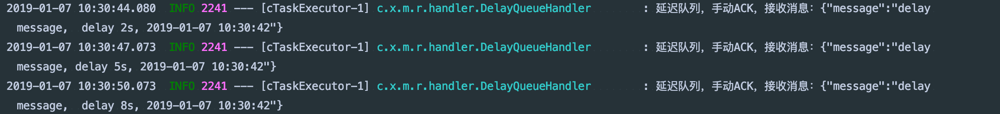

# spring-boot-demo-mq-rabbitmq

> 此 demo 主要演示了 Spring Boot 如何集成 RabbitMQ，并且演示了基于直接队列模式、分列模式、主题模式、延迟队列的消息发送和接收。

## 注意

作者编写本demo时，RabbitMQ 版本使用 `3.7.7-management`，使用 docker 运行，下面是所有步骤：

1. 下载镜像：`docker pull rabbitmq:3.7.7-management`

2. 运行容器：`docker run -d -p 5671:5617 -p 5672:5672 -p 4369:4369 -p 15671:15671 -p 15672:15672 -p 25672:25672 --name rabbit-3.7.7 rabbitmq:3.7.7-management`

3. 进入容器：`docker exec -it rabbit-3.7.7 /bin/bash`

4. 给容器安装 下载工具 wget：`apt-get install -y wget`

5. 下载插件包，因为我们的 `RabbitMQ` 版本为 `3.7.7` 所以我们安装 `3.7.x` 版本的延迟队列插件

   ```bash
   root@f72ac937f2be:/plugins# wget https://dl.bintray.com/rabbitmq/community-plugins/3.7.x/rabbitmq_delayed_message_exchange/rabbitmq_delayed_message_exchange-20171201-3.7.x.zip
   ```

6. 给容器安装 解压工具 unzip：`apt-get install -y unzip`

7. 解压插件包

   ```bash
   root@f72ac937f2be:/plugins# unzip rabbitmq_delayed_message_exchange-20171201-3.7.x.zip
   Archive:  rabbitmq_delayed_message_exchange-20171201-3.7.x.zip
     inflating: rabbitmq_delayed_message_exchange-20171201-3.7.x.ez
   ```

8. 启动延迟队列插件

   ```yaml
   root@f72ac937f2be:/plugins# rabbitmq-plugins enable rabbitmq_delayed_message_exchange
   The following plugins have been configured:
     rabbitmq_delayed_message_exchange
     rabbitmq_management
     rabbitmq_management_agent
     rabbitmq_web_dispatch
   Applying plugin configuration to rabbit@f72ac937f2be...
   The following plugins have been enabled:
     rabbitmq_delayed_message_exchange
   
   started 1 plugins.
   ```

9. 退出容器：`exit`

10. 停止容器：`docker stop rabbit-3.7.7`

11. 启动容器：`docker start rabbit-3.7.7`

## pom.xml

```xml
<?xml version="1.0" encoding="UTF-8"?>
<project xmlns="http://maven.apache.org/POM/4.0.0" xmlns:xsi="http://www.w3.org/2001/XMLSchema-instance"
         xsi:schemaLocation="http://maven.apache.org/POM/4.0.0 http://maven.apache.org/xsd/maven-4.0.0.xsd">
    <modelVersion>4.0.0</modelVersion>

    <artifactId>spring-boot-demo-mq-rabbitmq</artifactId>
    <version>1.0.0-SNAPSHOT</version>
    <packaging>jar</packaging>

    <name>spring-boot-demo-mq-rabbitmq</name>
    <description>Demo project for Spring Boot</description>

    <parent>
        <groupId>com.xkcoding</groupId>
        <artifactId>spring-boot-demo</artifactId>
        <version>1.0.0-SNAPSHOT</version>
    </parent>

    <properties>
        <project.build.sourceEncoding>UTF-8</project.build.sourceEncoding>
        <project.reporting.outputEncoding>UTF-8</project.reporting.outputEncoding>
        <java.version>1.8</java.version>
    </properties>

    <dependencies>
        <dependency>
            <groupId>org.springframework.boot</groupId>
            <artifactId>spring-boot-starter-web</artifactId>
        </dependency>

        <dependency>
            <groupId>org.springframework.boot</groupId>
            <artifactId>spring-boot-starter-amqp</artifactId>
        </dependency>

        <dependency>
            <groupId>org.springframework.boot</groupId>
            <artifactId>spring-boot-starter-test</artifactId>
            <scope>test</scope>
        </dependency>

        <dependency>
            <groupId>org.projectlombok</groupId>
            <artifactId>lombok</artifactId>
            <optional>true</optional>
        </dependency>

        <dependency>
            <groupId>cn.hutool</groupId>
            <artifactId>hutool-all</artifactId>
        </dependency>

        <dependency>
            <groupId>com.google.guava</groupId>
            <artifactId>guava</artifactId>
        </dependency>
    </dependencies>

    <build>
        <finalName>spring-boot-demo-mq-rabbitmq</finalName>
        <plugins>
            <plugin>
                <groupId>org.springframework.boot</groupId>
                <artifactId>spring-boot-maven-plugin</artifactId>
            </plugin>
        </plugins>
    </build>

</project>
```

## application.yml

```yaml
server:
  port: 8080
  servlet:
    context-path: /demo
spring:
  rabbitmq:
    host: localhost
    port: 5672
    username: guest
    password: guest
    virtual-host: /
    # 手动提交消息
    listener:
      simple:
        acknowledge-mode: manual
      direct:
        acknowledge-mode: manual
```

## RabbitConsts.java

```java
/**
 * <p>
 * RabbitMQ常量池
 * </p>
 *
 * @package: com.xkcoding.mq.rabbitmq.constants
 * @description: RabbitMQ常量池
 * @author: yangkai.shen
 * @date: Created in 2018-12-29 17:08
 * @copyright: Copyright (c) 2018
 * @version: V1.0
 * @modified: yangkai.shen
 */
public interface RabbitConsts {
    /**
     * 直接模式1
     */
    String DIRECT_MODE_QUEUE_ONE = "queue.direct.1";

    /**
     * 队列2
     */
    String QUEUE_TWO = "queue.2";

    /**
     * 队列3
     */
    String QUEUE_THREE = "3.queue";

    /**
     * 分列模式
     */
    String FANOUT_MODE_QUEUE = "fanout.mode";

    /**
     * 主题模式
     */
    String TOPIC_MODE_QUEUE = "topic.mode";

    /**
     * 路由1
     */
    String TOPIC_ROUTING_KEY_ONE = "queue.#";

    /**
     * 路由2
     */
    String TOPIC_ROUTING_KEY_TWO = "*.queue";

    /**
     * 路由3
     */
    String TOPIC_ROUTING_KEY_THREE = "3.queue";

    /**
     * 延迟队列
     */
    String DELAY_QUEUE = "delay.queue";

    /**
     * 延迟队列交换器
     */
    String DELAY_MODE_QUEUE = "delay.mode";
}
```

## RabbitMqConfig.java

> RoutingKey规则
>
> - 路由格式必须以 `.` 分隔，比如 `user.email` 或者 `user.aaa.email`
> - 通配符 `*` ，代表一个占位符，或者说一个单词，比如路由为 `user.*`，那么 **`user.email`** 可以匹配，但是 *`user.aaa.email`* 就匹配不了
> - 通配符 `#` ，代表一个或多个占位符，或者说一个或多个单词，比如路由为 `user.#`，那么 **`user.email`** 可以匹配，**`user.aaa.email `** 也可以匹配

```java
/**
 * <p>
 * RabbitMQ配置，主要是配置队列，如果提前存在该队列，可以省略本配置类
 * </p>
 *
 * @package: com.xkcoding.mq.rabbitmq.config
 * @description: RabbitMQ配置，主要是配置队列，如果提前存在该队列，可以省略本配置类
 * @author: yangkai.shen
 * @date: Created in 2018-12-29 17:03
 * @copyright: Copyright (c) 2018
 * @version: V1.0
 * @modified: yangkai.shen
 */
@Slf4j
@Configuration
public class RabbitMqConfig {

    @Bean
    public RabbitTemplate rabbitTemplate(CachingConnectionFactory connectionFactory) {
        connectionFactory.setPublisherConfirms(true);
        connectionFactory.setPublisherReturns(true);
        RabbitTemplate rabbitTemplate = new RabbitTemplate(connectionFactory);
        rabbitTemplate.setMandatory(true);
        rabbitTemplate.setConfirmCallback((correlationData, ack, cause) -> log.info("消息发送成功:correlationData({}),ack({}),cause({})", correlationData, ack, cause));
        rabbitTemplate.setReturnCallback((message, replyCode, replyText, exchange, routingKey) -> log.info("消息丢失:exchange({}),route({}),replyCode({}),replyText({}),message:{}", exchange, routingKey, replyCode, replyText, message));
        return rabbitTemplate;
    }

    /**
     * 直接模式队列1
     */
    @Bean
    public Queue directOneQueue() {
        return new Queue(RabbitConsts.DIRECT_MODE_QUEUE_ONE);
    }

    /**
     * 队列2
     */
    @Bean
    public Queue queueTwo() {
        return new Queue(RabbitConsts.QUEUE_TWO);
    }

    /**
     * 队列3
     */
    @Bean
    public Queue queueThree() {
        return new Queue(RabbitConsts.QUEUE_THREE);
    }

    /**
     * 分列模式队列
     */
    @Bean
    public FanoutExchange fanoutExchange() {
        return new FanoutExchange(RabbitConsts.FANOUT_MODE_QUEUE);
    }

    /**
     * 分列模式绑定队列1
     *
     * @param directOneQueue 绑定队列1
     * @param fanoutExchange 分列模式交换器
     */
    @Bean
    public Binding fanoutBinding1(Queue directOneQueue, FanoutExchange fanoutExchange) {
        return BindingBuilder.bind(directOneQueue).to(fanoutExchange);
    }

    /**
     * 分列模式绑定队列2
     *
     * @param queueTwo       绑定队列2
     * @param fanoutExchange 分列模式交换器
     */
    @Bean
    public Binding fanoutBinding2(Queue queueTwo, FanoutExchange fanoutExchange) {
        return BindingBuilder.bind(queueTwo).to(fanoutExchange);
    }

    /**
     * 主题模式队列
     * <li>路由格式必须以 . 分隔，比如 user.email 或者 user.aaa.email</li>
     * <li>通配符 * ，代表一个占位符，或者说一个单词，比如路由为 user.*，那么 user.email 可以匹配，但是 user.aaa.email 就匹配不了</li>
     * <li>通配符 # ，代表一个或多个占位符，或者说一个或多个单词，比如路由为 user.#，那么 user.email 可以匹配，user.aaa.email 也可以匹配</li>
     */
    @Bean
    public TopicExchange topicExchange() {
        return new TopicExchange(RabbitConsts.TOPIC_MODE_QUEUE);
    }


    /**
     * 主题模式绑定分列模式
     *
     * @param fanoutExchange 分列模式交换器
     * @param topicExchange  主题模式交换器
     */
    @Bean
    public Binding topicBinding1(FanoutExchange fanoutExchange, TopicExchange topicExchange) {
        return BindingBuilder.bind(fanoutExchange).to(topicExchange).with(RabbitConsts.TOPIC_ROUTING_KEY_ONE);
    }

    /**
     * 主题模式绑定队列2
     *
     * @param queueTwo      队列2
     * @param topicExchange 主题模式交换器
     */
    @Bean
    public Binding topicBinding2(Queue queueTwo, TopicExchange topicExchange) {
        return BindingBuilder.bind(queueTwo).to(topicExchange).with(RabbitConsts.TOPIC_ROUTING_KEY_TWO);
    }

    /**
     * 主题模式绑定队列3
     *
     * @param queueThree    队列3
     * @param topicExchange 主题模式交换器
     */
    @Bean
    public Binding topicBinding3(Queue queueThree, TopicExchange topicExchange) {
        return BindingBuilder.bind(queueThree).to(topicExchange).with(RabbitConsts.TOPIC_ROUTING_KEY_THREE);
    }

    /**
     * 延迟队列
     */
    @Bean
    public Queue delayQueue() {
        return new Queue(RabbitConsts.DELAY_QUEUE, true);
    }

    /**
     * 延迟队列交换器, x-delayed-type 和 x-delayed-message 固定
     */
    @Bean
    public CustomExchange delayExchange() {
        Map<String, Object> args = Maps.newHashMap();
        args.put("x-delayed-type", "direct");
        return new CustomExchange(RabbitConsts.DELAY_MODE_QUEUE, "x-delayed-message", true, false, args);
    }

    /**
     * 延迟队列绑定自定义交换器
     *
     * @param delayQueue    队列
     * @param delayExchange 延迟交换器
     */
    @Bean
    public Binding delayBinding(Queue delayQueue, CustomExchange delayExchange) {
        return BindingBuilder.bind(delayQueue).to(delayExchange).with(RabbitConsts.DELAY_QUEUE).noargs();
    }

}
```

## 消息处理器

> 只展示直接队列模式的消息处理，其余模式请看源码
>
> 需要注意：如果 `spring.rabbitmq.listener.direct.acknowledge-mode: auto`，则会自动Ack，否则需要手动Ack

### DirectQueueOneHandler.java

```java
/**
 * <p>
 * 直接队列1 处理器
 * </p>
 *
 * @package: com.xkcoding.mq.rabbitmq.handler
 * @description: 直接队列1 处理器
 * @author: yangkai.shen
 * @date: Created in 2019-01-04 15:42
 * @copyright: Copyright (c) 2019
 * @version: V1.0
 * @modified: yangkai.shen
 */
@Slf4j
@RabbitListener(queues = RabbitConsts.DIRECT_MODE_QUEUE_ONE)
@Component
public class DirectQueueOneHandler {

    /**
     * 如果 spring.rabbitmq.listener.direct.acknowledge-mode: auto，则可以用这个方式，会自动ack
     */
    // @RabbitHandler
    public void directHandlerAutoAck(MessageStruct message) {
        log.info("直接队列处理器，接收消息：{}", JSONUtil.toJsonStr(message));
    }

    @RabbitHandler
    public void directHandlerManualAck(MessageStruct messageStruct, Message message, Channel channel) {
        //  如果手动ACK,消息会被监听消费,但是消息在队列中依旧存在,如果 未配置 acknowledge-mode 默认是会在消费完毕后自动ACK掉
        final long deliveryTag = message.getMessageProperties().getDeliveryTag();
        try {
            log.info("直接队列1，手动ACK，接收消息：{}", JSONUtil.toJsonStr(messageStruct));
            // 通知 MQ 消息已被成功消费,可以ACK了
            channel.basicAck(deliveryTag, false);
        } catch (IOException e) {
            try {
                // 处理失败,重新压入MQ
                channel.basicRecover();
            } catch (IOException e1) {
                e1.printStackTrace();
            }
        }
    }
}
```

## SpringBootDemoMqRabbitmqApplicationTests.java

```java
@RunWith(SpringRunner.class)
@SpringBootTest
public class SpringBootDemoMqRabbitmqApplicationTests {
    @Autowired
    private RabbitTemplate rabbitTemplate;

    /**
     * 测试直接模式发送
     */
    @Test
    public void sendDirect() {
        rabbitTemplate.convertAndSend(RabbitConsts.DIRECT_MODE_QUEUE_ONE, new MessageStruct("direct message"));
    }

    /**
     * 测试分列模式发送
     */
    @Test
    public void sendFanout() {
        rabbitTemplate.convertAndSend(RabbitConsts.FANOUT_MODE_QUEUE, "", new MessageStruct("fanout message"));
    }

    /**
     * 测试主题模式发送1
     */
    @Test
    public void sendTopic1() {
        rabbitTemplate.convertAndSend(RabbitConsts.TOPIC_MODE_QUEUE, "queue.aaa.bbb", new MessageStruct("topic message"));
    }

    /**
     * 测试主题模式发送2
     */
    @Test
    public void sendTopic2() {
        rabbitTemplate.convertAndSend(RabbitConsts.TOPIC_MODE_QUEUE, "ccc.queue", new MessageStruct("topic message"));
    }

    /**
     * 测试主题模式发送3
     */
    @Test
    public void sendTopic3() {
        rabbitTemplate.convertAndSend(RabbitConsts.TOPIC_MODE_QUEUE, "3.queue", new MessageStruct("topic message"));
    }

    /**
     * 测试延迟队列发送
     */
    @Test
    public void sendDelay() {
        rabbitTemplate.convertAndSend(RabbitConsts.DELAY_MODE_QUEUE, RabbitConsts.DELAY_QUEUE, new MessageStruct("delay message, delay 5s, " + DateUtil
                .date()), message -> {
            message.getMessageProperties().setHeader("x-delay", 5000);
            return message;
        });
        rabbitTemplate.convertAndSend(RabbitConsts.DELAY_MODE_QUEUE, RabbitConsts.DELAY_QUEUE, new MessageStruct("delay message,  delay 2s, " + DateUtil
                .date()), message -> {
            message.getMessageProperties().setHeader("x-delay", 2000);
            return message;
        });
        rabbitTemplate.convertAndSend(RabbitConsts.DELAY_MODE_QUEUE, RabbitConsts.DELAY_QUEUE, new MessageStruct("delay message,  delay 8s, " + DateUtil
                .date()), message -> {
            message.getMessageProperties().setHeader("x-delay", 8000);
            return message;
        });
    }

}
```

## 运行效果

### 直接模式


### 分列模式



### 主题模式

#### RoutingKey：`queue.#`



#### RoutingKey：`*.queue`


#### RoutingKey：`3.queue`



### 延迟队列



## 参考

1. Spring AMQP 官方文档：https://docs.spring.io/spring-amqp/docs/2.1.0.RELEASE/reference/html/
2. RabbitMQ 官网：http://www.rabbitmq.com/
3. RabbitMQ延迟队列：https://www.cnblogs.com/vipstone/p/9967649.html