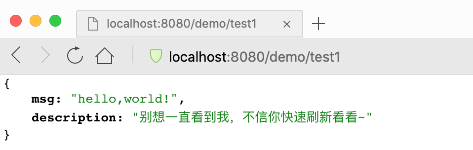
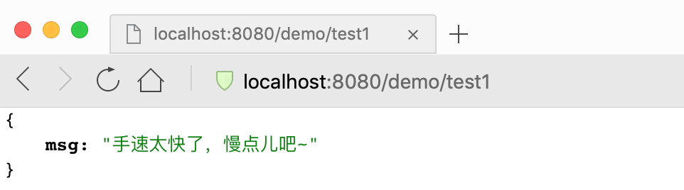
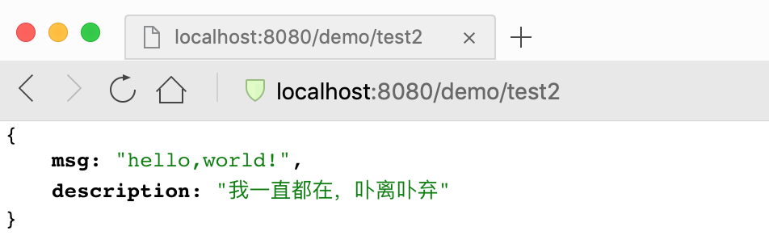

# spring-boot-demo-ratelimit-guava

> 此 demo 主要演示了 Spring Boot 项目如何通过 AOP 结合 Guava 的 RateLimiter 实现限流，旨在保护 API 被恶意频繁访问的问题。

## 1. 主要代码

### 1.1. pom.xml

```xml
<?xml version="1.0" encoding="UTF-8"?>
<project xmlns="http://maven.apache.org/POM/4.0.0" xmlns:xsi="http://www.w3.org/2001/XMLSchema-instance"
         xsi:schemaLocation="http://maven.apache.org/POM/4.0.0 https://maven.apache.org/xsd/maven-4.0.0.xsd">
  <modelVersion>4.0.0</modelVersion>

  <artifactId>spring-boot-demo-ratelimit-guava</artifactId>
  <version>1.0.0-SNAPSHOT</version>
  <packaging>jar</packaging>

  <name>spring-boot-demo-ratelimit-guava</name>
  <description>Demo project for Spring Boot</description>

  <parent>
    <groupId>com.xkcoding</groupId>
    <artifactId>spring-boot-demo</artifactId>
    <version>1.0.0-SNAPSHOT</version>
  </parent>

  <properties>
    <project.build.sourceEncoding>UTF-8</project.build.sourceEncoding>
    <project.reporting.outputEncoding>UTF-8</project.reporting.outputEncoding>
    <java.version>1.8</java.version>
  </properties>

  <dependencies>
    <dependency>
      <groupId>org.springframework.boot</groupId>
      <artifactId>spring-boot-starter-web</artifactId>
    </dependency>

    <dependency>
      <groupId>org.springframework.boot</groupId>
      <artifactId>spring-boot-starter-aop</artifactId>
    </dependency>

    <dependency>
      <groupId>cn.hutool</groupId>
      <artifactId>hutool-all</artifactId>
    </dependency>

    <dependency>
      <groupId>com.google.guava</groupId>
      <artifactId>guava</artifactId>
    </dependency>

    <dependency>
      <groupId>org.springframework.boot</groupId>
      <artifactId>spring-boot-starter-test</artifactId>
      <scope>test</scope>
    </dependency>

    <dependency>
      <groupId>org.projectlombok</groupId>
      <artifactId>lombok</artifactId>
      <optional>true</optional>
    </dependency>
  </dependencies>

  <build>
    <finalName>spring-boot-demo-ratelimit-guava</finalName>
    <plugins>
      <plugin>
        <groupId>org.springframework.boot</groupId>
        <artifactId>spring-boot-maven-plugin</artifactId>
      </plugin>
    </plugins>
  </build>

</project>
```

### 1.2. 定义一个限流注解 `RateLimiter.java`

> 注意代码里使用了 `AliasFor` 设置一组属性的别名，所以获取注解的时候，需要通过 `Spring` 提供的注解工具类 `AnnotationUtils` 获取，不可以通过 `AOP` 参数注入的方式获取，否则有些属性的值将会设置不进去。

```java
/**
 * <p>
 * 限流注解，添加了 {@link AliasFor} 必须通过 {@link AnnotationUtils} 获取，才会生效
 *
 * @author yangkai.shen
 * @date Created in 2019/9/12 14:14
 * @see AnnotationUtils
 * </p>
 */
@Target(ElementType.METHOD)
@Retention(RetentionPolicy.RUNTIME)
@Documented
public @interface RateLimiter {
    int NOT_LIMITED = 0;

    /**
     * qps
     */
    @AliasFor("qps") double value() default NOT_LIMITED;

    /**
     * qps
     */
    @AliasFor("value") double qps() default NOT_LIMITED;

    /**
     * 超时时长
     */
    int timeout() default 0;

    /**
     * 超时时间单位
     */
    TimeUnit timeUnit() default TimeUnit.MILLISECONDS;
}
```

### 1.3. 定义一个切面 `RateLimiterAspect.java`

```java
/**
 * <p>
 * 限流切面
 * </p>
 *
 * @author yangkai.shen
 * @date Created in 2019/9/12 14:27
 */
@Slf4j
@Aspect
@Component
public class RateLimiterAspect {
    private static final com.google.common.util.concurrent.RateLimiter RATE_LIMITER = com.google.common.util.concurrent.RateLimiter.create(Double.MAX_VALUE);

    @Pointcut("@annotation(com.xkcoding.ratelimit.guava.annotation.RateLimiter)")
    public void rateLimit() {

    }

    @Around("rateLimit()")
    public Object pointcut(ProceedingJoinPoint point) throws Throwable {
        MethodSignature signature = (MethodSignature) point.getSignature();
        Method method = signature.getMethod();
        // 通过 AnnotationUtils.findAnnotation 获取 RateLimiter 注解
        RateLimiter rateLimiter = AnnotationUtils.findAnnotation(method, RateLimiter.class);
        if (rateLimiter != null && rateLimiter.qps() > RateLimiter.NOT_LIMITED) {
            double qps = rateLimiter.qps();
            log.debug("【{}】的QPS设置为: {}", method.getName(), qps);
            // 重新设置 QPS
            RATE_LIMITER.setRate(qps);
            // 尝试获取令牌
            if (!RATE_LIMITER.tryAcquire(rateLimiter.timeout(), rateLimiter.timeUnit())) {
                throw new RuntimeException("手速太快了，慢点儿吧~");
            }
        }
        return point.proceed();
    }
}
```

### 1.4. 定义两个API接口用于测试限流

```java
/**
 * <p>
 * 测试
 * </p>
 *
 * @author yangkai.shen
 * @date Created in 2019/9/12 14:22
 */
@Slf4j
@RestController
public class TestController {

    @RateLimiter(value = 1.0, timeout = 300)
    @GetMapping("/test1")
    public Dict test1() {
        log.info("【test1】被执行了。。。。。");
        return Dict.create().set("msg", "hello,world!").set("description", "别想一直看到我，不信你快速刷新看看~");
    }

    @GetMapping("/test2")
    public Dict test2() {
        log.info("【test2】被执行了。。。。。");
        return Dict.create().set("msg", "hello,world!").set("description", "我一直都在，卟离卟弃");
    }
}
```

## 2. 测试

- test1 接口未被限流的时候



- test1 接口频繁刷新，触发限流的时候



- test2 接口不做限流，可以一直刷新



## 3. 参考

- [限流原理解读之guava中的RateLimiter](https://juejin.im/post/5bb48d7b5188255c865e31bc)

- [使用Guava的RateLimiter做限流](https://my.oschina.net/hanchao/blog/1833612)

