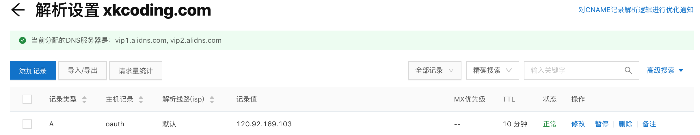
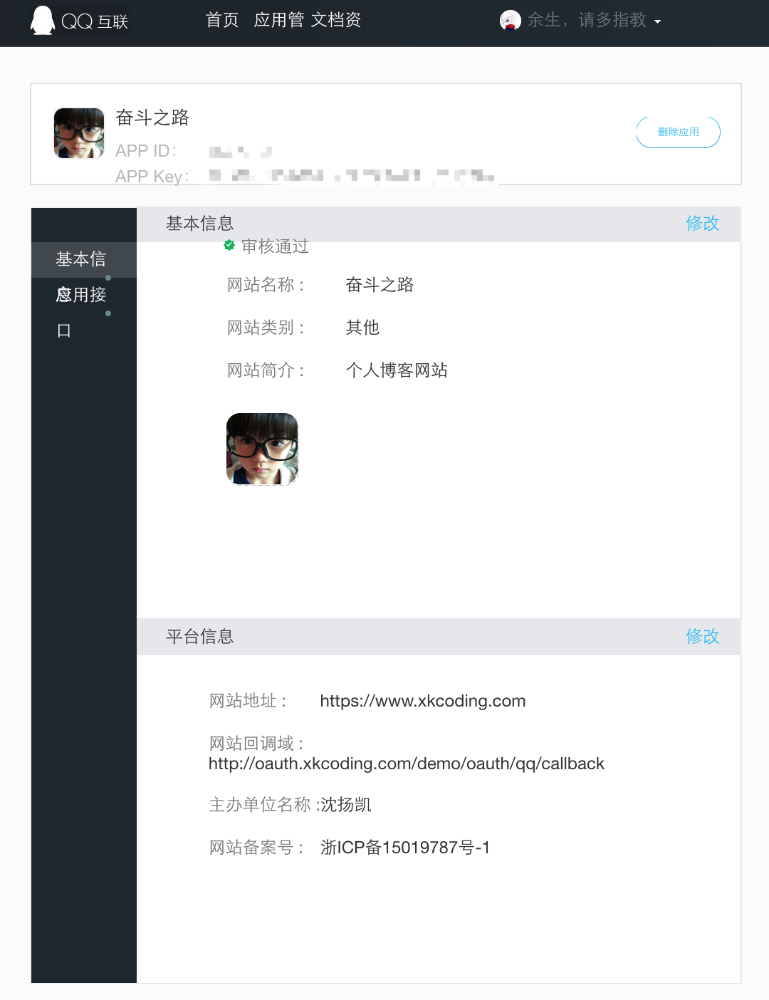
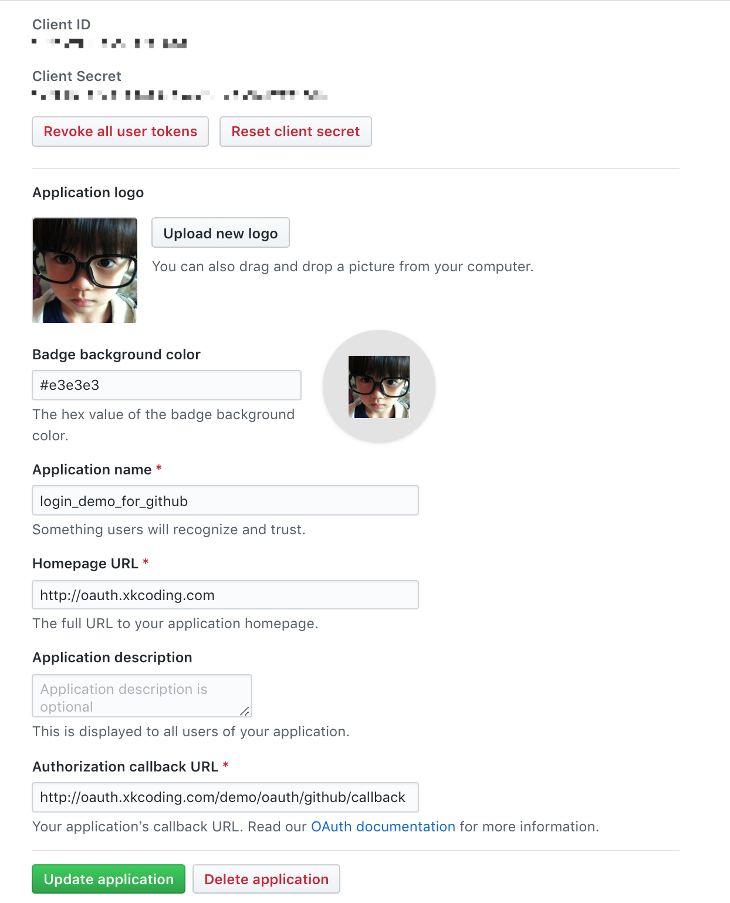
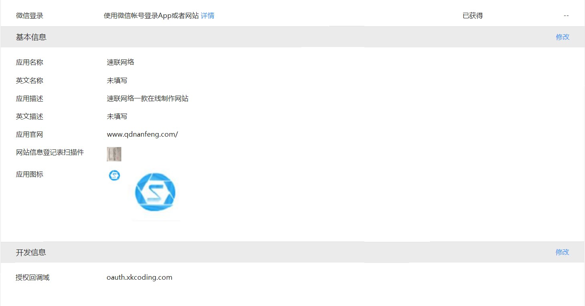
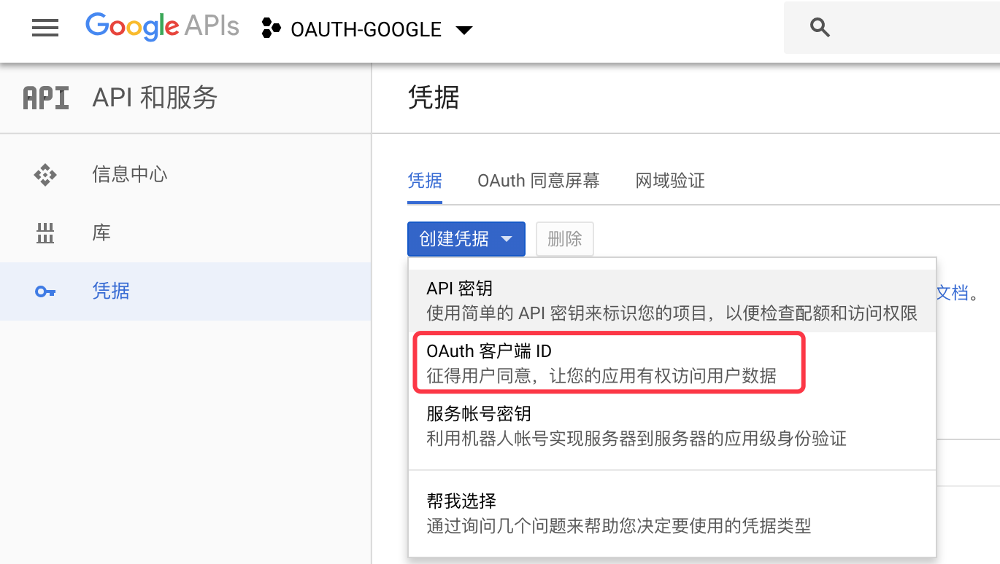
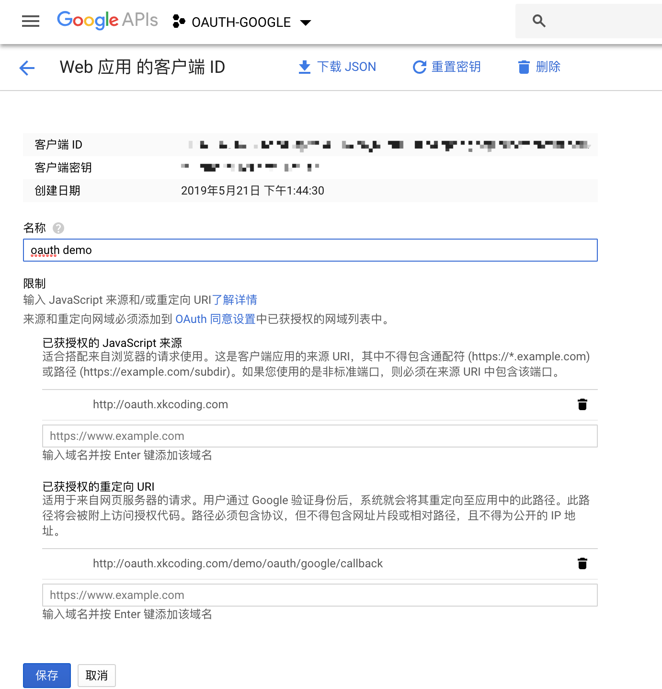
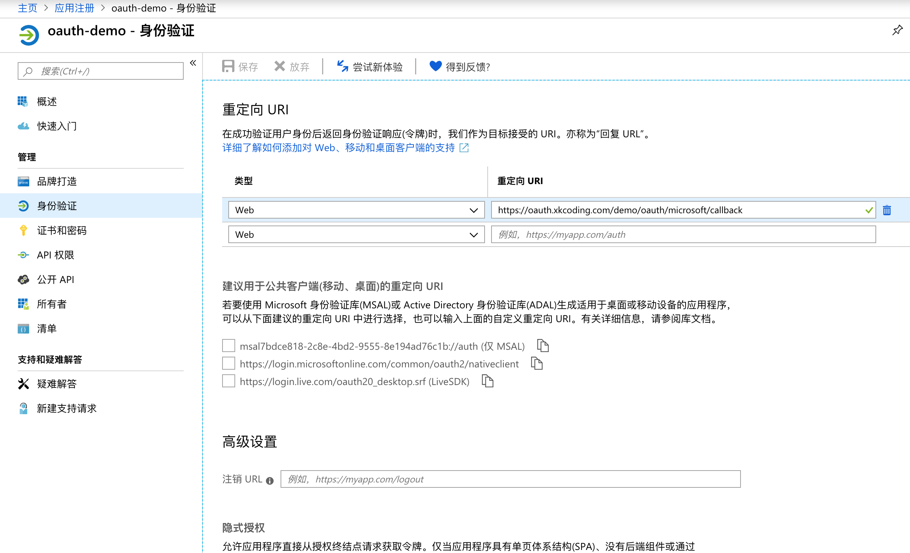
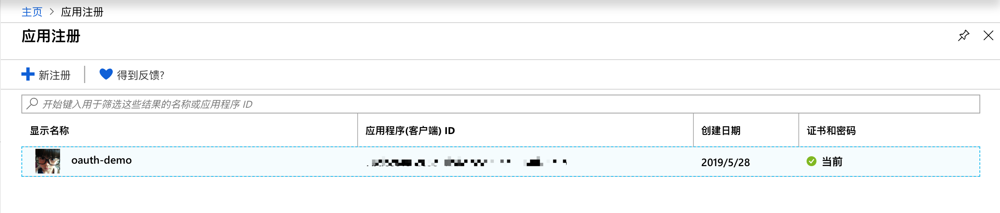
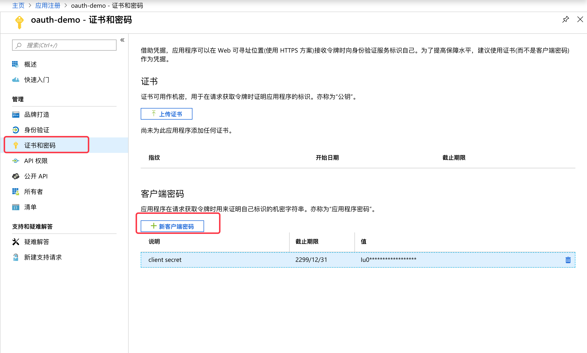
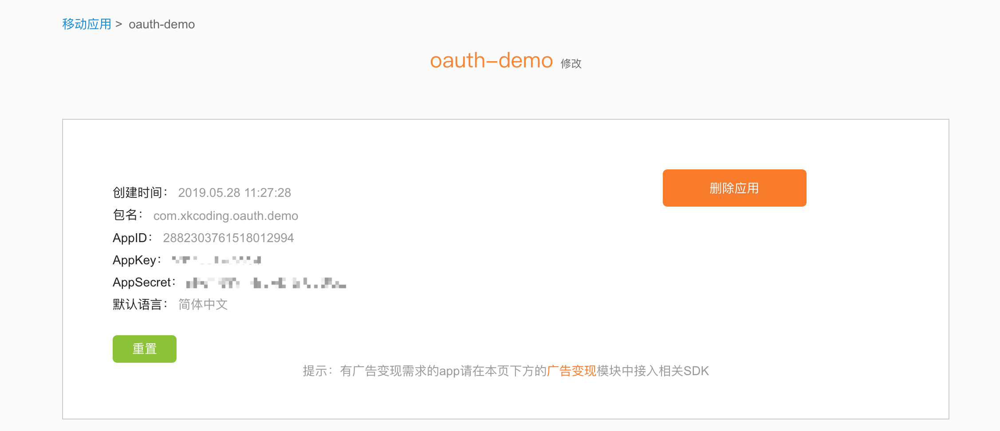

# spring-boot-demo-social

> 此 demo 主要演示 Spring Boot 项目如何使用 **[史上最全的第三方登录工具 - JustAuth](https://github.com/zhangyd-c/JustAuth)** 实现第三方登录，包括QQ登录、GitHub登录、微信登录、谷歌登录、微软登录、小米登录、企业微信登录。
>
> 通过 [justauth-spring-boot-starter](https://search.maven.org/artifact/com.xkcoding/justauth-spring-boot-starter) 快速集成，好嗨哟~
>
> JustAuth，如你所见，它仅仅是一个**第三方授权登录**的**工具类库**，它可以让我们脱离繁琐的第三方登录SDK，让登录变得**So easy!**
>
> 1. **全**：已集成十多家第三方平台（国内外常用的基本都已包含），后续依然还有扩展计划！
>2. **简**：API就是奔着最简单去设计的（见后面[`快速开始`](https://github.com/zhangyd-c/JustAuth#%E5%BF%AB%E9%80%9F%E5%BC%80%E5%A7%8B)），尽量让您用起来没有障碍感！
> 
>PS: 本人十分幸运的参与到了这个SDK的开发，主要开发了**QQ登录、微信登录、小米登录、微软登录、谷歌登录**这 **`5`** 个第三方登录，以及一些BUG的修复工作。再次感谢 [@母狼](https://github.com/zhangyd-c) 开源这个又好用又全面的第三方登录SDK。

如果技术选型是 `JFinal` 的，请查看此 [**`demo`**](https://github.com/xkcoding/jfinal-justauth-demo)

https://github.com/xkcoding/jfinal-justauth-demo

如果技术选型是 `ActFramework` 的，请查看此 [**`demo`**](https://github.com/xkcoding/act-justauth-demo)

https://github.com/xkcoding/act-justauth-demo

## 1. 环境准备

### 1.1. 公网服务器准备

首先准备一台有公网IP的服务器，可以选用阿里云或者腾讯云，如果选用的是阿里云的，可以使用我的[优惠链接](https://chuangke.aliyun.com/invite?userCode=r8z5amhr)购买。

### 1.2. 内网穿透frp搭建

> frp 安装程序：https://github.com/fatedier/frp/releases

#### 1.2.1. frp服务端搭建

服务端搭建在上一步准备的公网服务器上，因为服务器是centos7 x64的系统，因此，这里下载安装包版本为linux_amd64的 [frp_0.27.0_linux_amd64.tar.gz](https://github.com/fatedier/frp/releases/download/v0.27.0/frp_0.27.0_linux_amd64.tar.gz) 。

1. 下载安装包

   ```shell
   $ wget https://github.com/fatedier/frp/releases/download/v0.27.0/frp_0.27.0_linux_amd64.tar.gz
   ```

2. 解压安装包

   ```shell
   $ tar -zxvf frp_0.27.0_linux_amd64.tar.gz
   ```

3. 修改配置文件

   ```shell
   $ cd frp_0.27.0_linux_amd64
   $ vim frps.ini
   
   [common]                                                                                                                  
   bind_port = 7100                                                                                                          
   vhost_http_port = 7200
   ```

4. 启动frp服务端

   ```shell
   $ ./frps -c frps.ini
   2019/06/15 16:42:02 [I] [service.go:139] frps tcp listen on 0.0.0.0:7100
   2019/06/15 16:42:02 [I] [service.go:181] http service listen on 0.0.0.0:7200
   2019/06/15 16:42:02 [I] [root.go:204] Start frps success
   ```

#### 1.2.2. frp客户端搭建

客户端搭建在本地的Mac上，因此下载安装包版本为darwin_amd64的 [frp_0.27.0_darwin_amd64.tar.gz](https://github.com/fatedier/frp/releases/download/v0.27.0/frp_0.27.0_darwin_amd64.tar.gz) 。

1. 下载安装包

   ```shell
   $ wget https://github.com/fatedier/frp/releases/download/v0.27.0/frp_0.27.0_darwin_amd64.tar.gz
   ```

2. 解压安装包

   ```shell
   $ tar -zxvf frp_0.27.0_darwin_amd64.tar.gz
   ```

3. 修改配置文件，配置服务端ip端口及监听的域名信息

   ```shell
   $ cd frp_0.27.0_darwin_amd64
   $ vim frpc.ini
   
   [common]
   server_addr = 120.92.169.103
   server_port = 7100
   
   [web]
   type = http
   local_port = 8080
   custom_domains = oauth.xkcoding.com
   ```

4. 启动frp客户端

   ```shell
   $ ./frpc -c frpc.ini
   2019/06/15 16:48:52 [I] [service.go:221] login to server success, get run id [8bb83bae5c58afe6], server udp port [0]
   2019/06/15 16:48:52 [I] [proxy_manager.go:137] [8bb83bae5c58afe6] proxy added: [web]
   2019/06/15 16:48:52 [I] [control.go:144] [web] start proxy success
   ```

### 1.3. 配置域名解析

前往阿里云DNS解析，将域名解析到我们的公网服务器上，比如我的就是将 `oauth.xkcoding.com -> 120.92.169.103`



### 1.4. nginx代理

nginx 的搭建就不在此赘述了，只说配置

```nginx
server {
    listen       80;
    server_name  oauth.xkcoding.com;         
                                                                        
    location / {
        proxy_pass http://127.0.0.1:7200;
        proxy_set_header X-Forwarded-For $proxy_add_x_forwarded_for;
        proxy_set_header Host $http_host;
        proxy_set_header X-Forwarded-Proto $scheme;
        proxy_set_header   X-Real-IP        $remote_addr;                                                                 
        proxy_buffering off;                                                                                              
        sendfile off;                                                                                                     
        proxy_max_temp_file_size 0;                                                                                       
        client_max_body_size       10m;                                                                                   
        client_body_buffer_size    128k;                                                                                  
        proxy_connect_timeout      90;                                                                                    
        proxy_send_timeout         90;                                                                                    
        proxy_read_timeout         90;                                                                                    
        proxy_temp_file_write_size 64k;                                                                                   
        proxy_http_version 1.1;                                                                                           
        proxy_request_buffering off; 
    }
}
```

测试配置文件是否有问题

```shell
$ nginx -t
nginx: the configuration file /etc/nginx/nginx.conf syntax is ok
nginx: configuration file /etc/nginx/nginx.conf test is successful
```

重新加载配置文件，使其生效

```shell
$ nginx -s reload
```

> 现在当我们在浏览器输入 `oauth.xkcoding.com` 的时候，网络流量其实会经历以下几个步骤：
>
> 1. 通过之前配的DNS域名解析会访问到我们的公网服务器 `120.92.169.103` 的 80 端口
> 2. 再经过 nginx，代理到本地的 7200 端口
> 3. 再经过 frp 穿透到我们的 Mac 电脑的 8080 端口
> 4. 此时 8080 就是我们的应用程序端口

### 1.5. 第三方平台申请

#### 1.5.1. QQ互联平台申请

1. 前往 https://connect.qq.com/ 
2. 申请开发者
3. 应用管理 -> 添加网站应用，等待审核通过即可



#### 1.5.2. GitHub平台申请

1. 前往 https://github.com/settings/developers
2. 点击 `New OAuth App` 按钮创建应用



#### 1.5.3 微信开放平台申请

这里微信开放平台需要用企业的，个人没有资质，所以我在某宝租了一个月的资质，需要的可以 [戳我租赁](https://item.taobao.com/item.htm?spm=2013.1.w4023-5034755838.13.747a61a7ccfHwS&id=554942413474)

> 声明：本人与该店铺无利益相关，纯属个人觉得好用做分享
>
> 该店铺有两种方式：
>
> 1. 店铺支持帮你过企业资质，这里就用你自己的开放平台号就好了
> 2. 临时使用可以问店家租一个月进行开发，这里租了之后，店家会把 AppID 和 AppSecret 的信息发给你，你提供回调域就好了

因此这里我就贴出一张授权回调的地址作参考。



#### 1.5.4. 谷歌开放平台申请

1. 前往 https://console.developers.google.com/projectcreate 创建项目
2. 前往 https://console.developers.google.com/apis/credentials ，在第一步创建的项目下，添加应用





#### 1.5.5. 微软开放平台申请

1. 前往 https://portal.azure.com/#blade/Microsoft_AAD_RegisteredApps/ApplicationsListBlade 注册应用
2. 在注册应用的时候就需要填写回调地址，当然后期也可以重新修改



3. client id 在这里



4. client secret 需要自己在这里生成



#### 1.5.6. 小米开放平台申请

1. 申请小米开发者，审核通过
2. 前往 https://dev.mi.com/passport/oauth2/applist 添加oauth应用，选择 `创建网页应用`
3. 填写基本信息之后，进入应用信息页面填写 `回调地址`


4. 应用审核通过之后，可以在应用信息页面的 `应用详情` 查看到 AppKey 和 AppSecret，吐槽下，小米应用的审核速度特别慢，需要耐心等待。。。。



#### 1.5.7. 企业微信平台申请

> 参考：https://xkcoding.com/2019/08/06/use-justauth-integration-wechat-enterprise.html

## 2. 主要代码

> 本 demo 采用 Redis 缓存 state，所以请准备 Redis 环境，如果没有 Redis 环境，可以将配置文件的缓存配置为 
>
> ```yaml
> justauth:
> 	cache:
> 		type: default
> ```

### 2.1. pom.xml

```xml
<?xml version="1.0" encoding="UTF-8"?>
<project xmlns="http://maven.apache.org/POM/4.0.0" xmlns:xsi="http://www.w3.org/2001/XMLSchema-instance"
         xsi:schemaLocation="http://maven.apache.org/POM/4.0.0 http://maven.apache.org/xsd/maven-4.0.0.xsd">
  <modelVersion>4.0.0</modelVersion>

  <artifactId>spring-boot-demo-social</artifactId>
  <version>1.0.0-SNAPSHOT</version>
  <packaging>jar</packaging>

  <name>spring-boot-demo-social</name>
  <description>Demo project for Spring Boot</description>

  <parent>
    <groupId>com.xkcoding</groupId>
    <artifactId>spring-boot-demo</artifactId>
    <version>1.0.0-SNAPSHOT</version>
  </parent>

  <properties>
    <project.build.sourceEncoding>UTF-8</project.build.sourceEncoding>
    <project.reporting.outputEncoding>UTF-8</project.reporting.outputEncoding>
    <java.version>1.8</java.version>
    <justauth-spring-boot.version>1.1.0</justauth-spring-boot.version>
  </properties>

  <dependencies>
    <dependency>
      <groupId>org.springframework.boot</groupId>
      <artifactId>spring-boot-starter-web</artifactId>
    </dependency>

    <dependency>
      <groupId>org.springframework.boot</groupId>
      <artifactId>spring-boot-starter-test</artifactId>
      <scope>test</scope>
    </dependency>

    <dependency>
      <groupId>org.springframework.boot</groupId>
      <artifactId>spring-boot-starter-data-redis</artifactId>
    </dependency>

    <!-- 对象池，使用redis时必须引入 -->
    <dependency>
      <groupId>org.apache.commons</groupId>
      <artifactId>commons-pool2</artifactId>
    </dependency>

    <!-- oauth工具类 -->
    <dependency>
      <groupId>com.xkcoding</groupId>
      <artifactId>justauth-spring-boot-starter</artifactId>
      <version>${justauth-spring-boot.version}</version>
    </dependency>

    <dependency>
      <groupId>org.projectlombok</groupId>
      <artifactId>lombok</artifactId>
      <optional>true</optional>
    </dependency>

    <dependency>
      <groupId>com.google.guava</groupId>
      <artifactId>guava</artifactId>
    </dependency>

    <dependency>
      <groupId>cn.hutool</groupId>
      <artifactId>hutool-all</artifactId>
    </dependency>
  </dependencies>

  <build>
    <finalName>spring-boot-demo-social</finalName>
    <plugins>
      <plugin>
        <groupId>org.springframework.boot</groupId>
        <artifactId>spring-boot-maven-plugin</artifactId>
      </plugin>
    </plugins>
  </build>

</project>
```

### 2.2. application.yml

```yaml
server:
  port: 8080
  servlet:
    context-path: /demo

spring:
  redis:
    host: localhost
    # 连接超时时间（记得添加单位，Duration）
    timeout: 10000ms
    # Redis默认情况下有16个分片，这里配置具体使用的分片
    # database: 0
    lettuce:
      pool:
        # 连接池最大连接数（使用负值表示没有限制） 默认 8
        max-active: 8
        # 连接池最大阻塞等待时间（使用负值表示没有限制） 默认 -1
        max-wait: -1ms
        # 连接池中的最大空闲连接 默认 8
        max-idle: 8
        # 连接池中的最小空闲连接 默认 0
        min-idle: 0
  cache:
    # 一般来说是不用配置的，Spring Cache 会根据依赖的包自行装配
    type: redis

justauth:
  enabled: true
  type:
    qq:
      client-id: 10******85
      client-secret: 1f7d************************d629e
      redirect-uri: http://oauth.xkcoding.com/demo/oauth/qq/callback
    github:
      client-id: 2d25******d5f01086
      client-secret: 5a2919b************************d7871306d1
      redirect-uri: http://oauth.xkcoding.com/demo/oauth/github/callback
    wechat:
      client-id: wxdcb******4ff4
      client-secret: b4e9dc************************a08ed6d
      redirect-uri: http://oauth.xkcoding.com/demo/oauth/wechat/callback
    google:
      client-id: 716******17-6db******vh******ttj320i******userco******t.com
      client-secret: 9IBorn************7-E
      redirect-uri: http://oauth.xkcoding.com/demo/oauth/google/callback
    microsoft:
      client-id: 7bdce8******************e194ad76c1b
      client-secret: Iu0zZ4************************tl9PWan_.
      redirect-uri: https://oauth.xkcoding.com/demo/oauth/microsoft/callback
    mi:
      client-id: 288************2994
      client-secret: nFeTt89************************==
      redirect-uri: http://oauth.xkcoding.com/demo/oauth/mi/callback
    wechat_enterprise:
      client-id: ww58******f3************fbc
      client-secret: 8G6PCr00j************************rgk************AyzaPc78
      redirect-uri: http://oauth.xkcoding.com/demo/oauth/wechat_enterprise/callback
      agent-id: 1*******2
  cache:
    type: redis
    prefix: 'SOCIAL::STATE::'
    timeout: 1h
```

### 2.3. OauthController.java

```java
/**
 * <p>
 * 第三方登录 Controller
 * </p>
 *
 * @package: com.xkcoding.oauth.controller
 * @description: 第三方登录 Controller
 * @author: yangkai.shen
 * @date: Created in 2019-05-17 10:07
 * @copyright: Copyright (c) 2019
 * @version: V1.0
 * @modified: yangkai.shen
 */
@Slf4j
@RestController
@RequestMapping("/oauth")
@RequiredArgsConstructor(onConstructor_ = @Autowired)
public class OauthController {
    private final AuthRequestFactory factory;

    /**
     * 登录类型
     */
    @GetMapping
    public Map<String, String> loginType() {
        List<String> oauthList = factory.oauthList();
        return oauthList.stream().collect(Collectors.toMap(oauth -> oauth.toLowerCase() + "登录", oauth -> "http://oauth.xkcoding.com/demo/oauth/login/" + oauth.toLowerCase()));
    }

    /**
     * 登录
     *
     * @param oauthType 第三方登录类型
     * @param response  response
     * @throws IOException
     */
    @RequestMapping("/login/{oauthType}")
    public void renderAuth(@PathVariable String oauthType, HttpServletResponse response) throws IOException {
        AuthRequest authRequest = factory.get(getAuthSource(oauthType));
        response.sendRedirect(authRequest.authorize(oauthType + "::" + AuthStateUtils.createState()));
    }

    /**
     * 登录成功后的回调
     *
     * @param oauthType 第三方登录类型
     * @param callback  携带返回的信息
     * @return 登录成功后的信息
     */
    @RequestMapping("/{oauthType}/callback")
    public AuthResponse login(@PathVariable String oauthType, AuthCallback callback) {
        AuthRequest authRequest = factory.get(getAuthSource(oauthType));
        AuthResponse response = authRequest.login(callback);
        log.info("【response】= {}", JSONUtil.toJsonStr(response));
        return response;
    }

    private AuthSource getAuthSource(String type) {
        if (StrUtil.isNotBlank(type)) {
            return AuthSource.valueOf(type.toUpperCase());
        } else {
            throw new RuntimeException("不支持的类型");
        }
    }
}
```

### 2.4. 如果想要自定义 state 缓存

请看👉[这里](https://github.com/justauth/justauth-spring-boot-starter#2-%E7%BC%93%E5%AD%98%E9%85%8D%E7%BD%AE)

## 3. 运行方式

打开浏览器，输入 http://oauth.xkcoding.com/demo/oauth ，点击各个登录方式自行测试。

> `Google 登录，有可能因为祖国的强大导致测试失败，自行解决~` :kissing_smiling_eyes:


## 参考

1. JustAuth 项目地址：https://github.com/justauth/JustAuth
2. justauth-spring-boot-starter 地址：https://github.com/justauth/justauth-spring-boot-starter
3. frp内网穿透项目地址：https://github.com/fatedier/frp
4. frp内网穿透官方中文文档：https://github.com/fatedier/frp/blob/master/README_zh.md
5. Frp实现内网穿透：https://zhuanlan.zhihu.com/p/45445979
6. QQ互联文档：http://wiki.connect.qq.com/%E5%87%86%E5%A4%87%E5%B7%A5%E4%BD%9C_oauth2-0
7. 微信开放平台文档：https://open.weixin.qq.com/cgi-bin/showdocument?action=dir_list&t=resource/res_list&verify=1&id=open1419316505&token=&lang=zh_CN
8. GitHub第三方登录文档：https://developer.github.com/apps/building-oauth-apps/
9. 谷歌Oauth2文档：https://developers.google.com/identity/protocols/OpenIDConnect
10. 微软Oauth2文档：https://docs.microsoft.com/zh-cn/graph/auth-v2-user
11. 小米开放平台账号服务文档：https://dev.mi.com/console/doc/detail?pId=707


