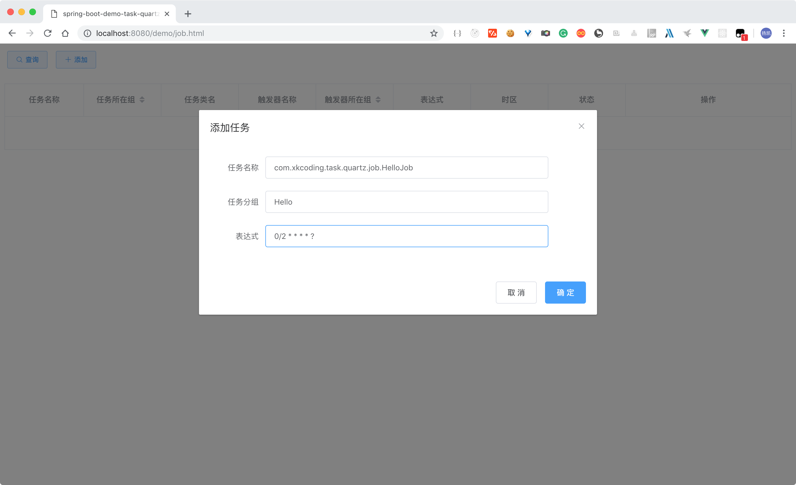
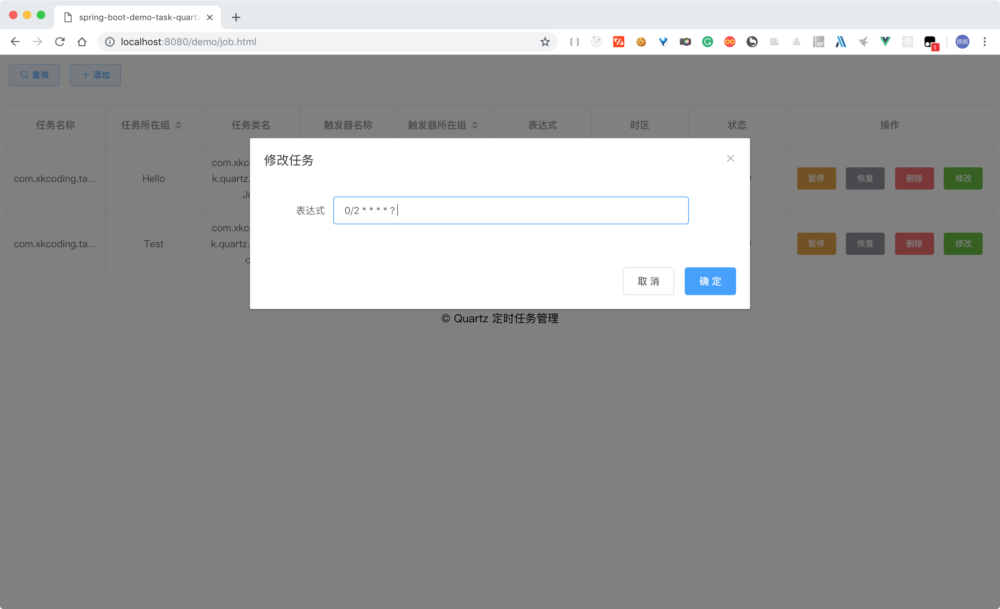
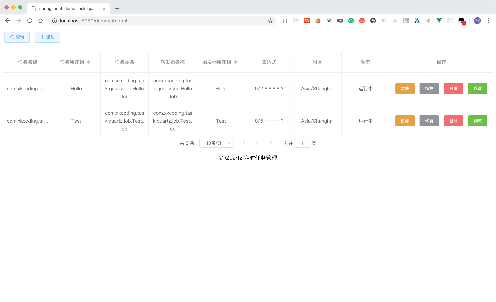
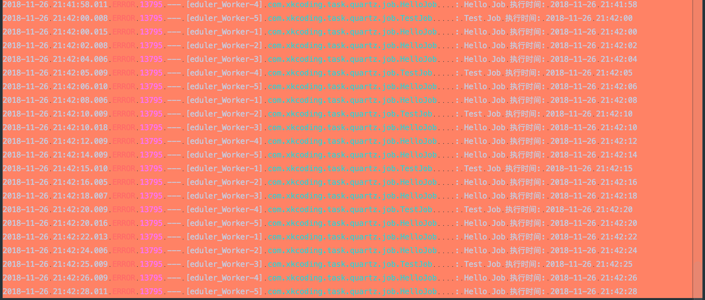
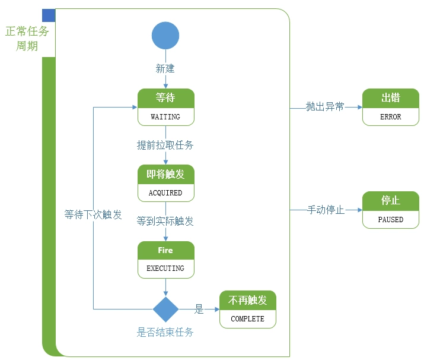

# spring-boot-demo-task-quartz

> 此 demo 主要演示了 Spring Boot 如何集成 Quartz 定时任务，并实现对定时任务的管理，包括新增定时任务，删除定时任务，暂停定时任务，恢复定时任务，修改定时任务启动时间，以及定时任务列表查询。

## 后端

### 初始化

在 `init/dbTables` 下选择 Quartz 需要的表结构，然后手动创建表。

### pom.xml

```xml
<?xml version="1.0" encoding="UTF-8"?>
<project xmlns="http://maven.apache.org/POM/4.0.0" xmlns:xsi="http://www.w3.org/2001/XMLSchema-instance"
         xsi:schemaLocation="http://maven.apache.org/POM/4.0.0 http://maven.apache.org/xsd/maven-4.0.0.xsd">
    <modelVersion>4.0.0</modelVersion>

    <artifactId>spring-boot-demo-task-quartz</artifactId>
    <version>1.0.0-SNAPSHOT</version>
    <packaging>jar</packaging>

    <name>spring-boot-demo-task-quartz</name>
    <description>Demo project for Spring Boot</description>

    <parent>
        <groupId>com.xkcoding</groupId>
        <artifactId>spring-boot-demo</artifactId>
        <version>1.0.0-SNAPSHOT</version>
    </parent>

    <properties>
        <project.build.sourceEncoding>UTF-8</project.build.sourceEncoding>
        <project.reporting.outputEncoding>UTF-8</project.reporting.outputEncoding>
        <java.version>1.8</java.version>
        <mybatis.mapper.version>2.1.0</mybatis.mapper.version>
        <mybatis.pagehelper.version>1.2.10</mybatis.pagehelper.version>
    </properties>

    <dependencies>
        <dependency>
            <groupId>org.springframework.boot</groupId>
            <artifactId>spring-boot-starter-web</artifactId>
        </dependency>

        <dependency>
            <groupId>org.springframework.boot</groupId>
            <artifactId>spring-boot-starter-quartz</artifactId>
        </dependency>

        <dependency>
            <groupId>tk.mybatis</groupId>
            <artifactId>mapper-spring-boot-starter</artifactId>
            <version>${mybatis.mapper.version}</version>
        </dependency>

        <dependency>
            <groupId>com.github.pagehelper</groupId>
            <artifactId>pagehelper-spring-boot-starter</artifactId>
            <version>${mybatis.pagehelper.version}</version>
        </dependency>

        <dependency>
            <groupId>mysql</groupId>
            <artifactId>mysql-connector-java</artifactId>
        </dependency>

        <dependency>
            <groupId>org.springframework.boot</groupId>
            <artifactId>spring-boot-starter-test</artifactId>
            <scope>test</scope>
        </dependency>

        <dependency>
            <groupId>cn.hutool</groupId>
            <artifactId>hutool-all</artifactId>
        </dependency>

        <dependency>
            <groupId>com.google.guava</groupId>
            <artifactId>guava</artifactId>
        </dependency>

        <dependency>
            <groupId>org.projectlombok</groupId>
            <artifactId>lombok</artifactId>
            <optional>true</optional>
        </dependency>
    </dependencies>

    <build>
        <finalName>spring-boot-demo-task-quartz</finalName>
        <plugins>
            <plugin>
                <groupId>org.springframework.boot</groupId>
                <artifactId>spring-boot-maven-plugin</artifactId>
            </plugin>
        </plugins>
    </build>

</project>
```

### application.yml

```yaml
server:
  port: 8080
  servlet:
    context-path: /demo
spring:
# 省略其余配置，具体请 clone 本项目，查看详情
# ......
  quartz:
    # 参见 org.springframework.boot.autoconfigure.quartz.QuartzProperties
    job-store-type: jdbc
    wait-for-jobs-to-complete-on-shutdown: true
    scheduler-name: SpringBootDemoScheduler
    properties:
      org.quartz.threadPool.threadCount: 5
      org.quartz.threadPool.threadPriority: 5
      org.quartz.threadPool.threadsInheritContextClassLoaderOfInitializingThread: true
      org.quartz.jobStore.misfireThreshold: 5000
      org.quartz.jobStore.class: org.quartz.impl.jdbcjobstore.JobStoreTX
      org.quartz.jobStore.driverDelegateClass: org.quartz.impl.jdbcjobstore.StdJDBCDelegate
      # 在调度流程的第一步，也就是拉取待即将触发的triggers时，是上锁的状态，即不会同时存在多个线程拉取到相同的trigger的情况，也就避免的重复调度的危险。参考：https://segmentfault.com/a/1190000015492260
      org.quartz.jobStore.acquireTriggersWithinLock: true

# 省略其余配置，具体请 clone 本项目，查看详情
# ......
```

---

> 后端其余代码请 clone 本项目，查看具体代码

## 前端

> 前端页面请 clone 本项目，查看具体代码

## 启动

1. clone 本项目
2. 初始化表格
3. 启动 `SpringBootDemoTaskQuartzApplication.java`
4. 打开浏览器，查看 http://localhost:8080/demo/job.html 










## 参考

- Spring Boot 官方文档：https://docs.spring.io/spring-boot/docs/2.1.0.RELEASE/reference/htmlsingle/#boot-features-quartz

- Quartz 官方文档：http://www.quartz-scheduler.org/documentation/quartz-2.2.x/quick-start.html

- Quartz 重复调度问题：https://segmentfault.com/a/1190000015492260

- 关于Quartz定时任务状态 (在 `QRTZ_TRIGGERS` 表中的 `TRIGGER_STATE` 字段)

  

- Vue.js 官方文档：https://cn.vuejs.org/v2/guide/

- Element-UI 官方文档：http://element-cn.eleme.io/#/zh-CN
